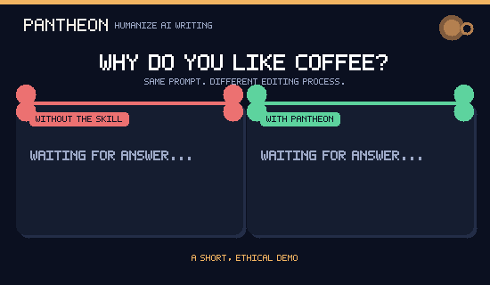

# Pantheon

<p align="center">
  <strong>Your voice, better formed.</strong><br>
  An evidence-guided skill for turning AI-assisted drafts into writing that sounds considered, specific, and recognizably yours.
</p>

<p align="center">
  <a href="#the-pantheon-promise">The promise</a> ·
  <a href="#try-it-in-one-message">Try it</a> ·
  <a href="#install">Install</a> ·
  <a href="#openclaw-step-by-step">OpenClaw</a> ·
  <a href="#hermes-agent-step-by-step">Hermes</a> ·
  <a href="#the-research-behind-it">Research</a>
</p>



> **A 5-second demo:** Pantheon does not invent a personality or promise detector evasion. It asks for a real detail, then uses that detail to make the writing more specific and useful.

> **Pantheon does not make writing “less detectable.” It makes authorship more present.**
>
> Bring the facts, judgment, examples, and rough edges that belong to you. Pantheon helps an AI assistant shape them into clear, credible prose—without inventing a life, hiding authorship, or sanding every sentence into the same polished template.

---

## The Pantheon promise

Good writing is more than clean grammar. It carries evidence, a point of view, a sense of proportion, and a reader in mind. Pantheon is a reusable skill for the moments when an AI draft feels generic, overly glossy, or unlike its author.

| You bring | Pantheon helps protect and strengthen |
| --- | --- |
| Real facts, notes, decisions, and limits | Accuracy, citations, names, numbers, and required terms |
| A sample of how you actually write | Tone, cadence, directness, and legitimate regional language |
| A reader and a purpose | Structure, clarity, relevance, and the right level of detail |
| Your own judgment | Specific claims, honest uncertainty, and a defensible point of view |

### What changes—and what must not

| Refine | Preserve |
| --- | --- |
| Empty intensifiers, repetitive transitions, stock phrasing, vague claims, and decorative conclusions | Meaning, evidence, quotations, citations, disclosures, constraints, and the author’s real experience |

Pantheon treats words such as `delve`, `robust`, or `transformative` as a reason to examine the sentence, not as a forbidden-word list. Human writing is not a punctuation trick or a blacklist.

## See the difference

**Before — polished, but anonymous**

> This transformative initiative represents a pivotal opportunity to leverage collaboration and drive meaningful outcomes across the organization.

**After — grounded, but still professional**

> The new hand-off gives support and product one shared queue. It should shorten the time customers wait for an answer, but we still need to test it with the evening team.

The second version works only because it contains usable information: a concrete change, a likely effect, and an honest limit. **If those details are not real, Pantheon should ask for them—not make them up.**

## Try it in one message

Paste this into Codex, Claude Code, Hermes Agent, or OpenClaw after installing:

```text
Use the humanize-ai-writing skill.

Audience: [who will read this]
Purpose: [what they need to understand or do]
Voice: [e.g., direct, warm, precise]
Non-negotiables: preserve every number, citation, and factual claim.

Revise this draft so it is specific and natural. Do not add experiences,
facts, or certainty that I did not provide. Explain any substantive change.

[paste draft]
```

### Three good ways to use Pantheon

| Situation | Ask Pantheon to… |
| --- | --- |
| A client email sounds stiff | Keep the facts and your direct tone; make the request clearer. |
| An article feels assembled from templates | Audit each generic passage as **keep**, **replace**, or **cut**, then revise only with supportable detail. |
| You need a consistent personal voice | Compare the draft with two real writing samples and explain where the voice shifted. |

> [!TIP]
> A short voice sample and real context are more valuable than a long list of “AI words” to avoid.

---

## Install

Choose one route: the universal command below for several tools, or the dedicated **OpenClaw** and **Hermes Agent** guides if you use one of those tools only.

### One command for every supported tool

Works with **Codex, Claude Code, Hermes Agent, and OpenClaw**. Open a terminal, paste this command, then press Enter:

```bash
npx skills add bunnyputih/pantheon --skill humanize-ai-writing --global --agent codex --agent claude-code --agent hermes-agent --agent openclaw --copy
```

When prompted, choose **Copy** and confirm. Then close and reopen your AI tool.

<details>
<summary><strong>Install in only one tool</strong></summary>

Replace the four `--agent …` parts above with one of these:

| Tool | Add this |
| --- | --- |
| Codex | `--agent codex` |
| Claude Code | `--agent claude-code` |
| Hermes Agent | `--agent hermes-agent` |
| OpenClaw | `--agent openclaw` |

For Codex only:

```bash
npx skills add bunnyputih/pantheon --skill humanize-ai-writing --global --agent codex --copy
```

</details>

<details>
<summary><strong>No terminal? Install from a ZIP</strong></summary>

1. Click the green **Code** button on this page, then **Download ZIP**.
2. Open the downloaded file and copy the `pantheon` folder.
3. Paste it into the matching folder below. Create parent folders if needed.
4. Rename the copied `pantheon` folder to `humanize-ai-writing`.
5. Restart your AI tool.

| Tool | Mac/Linux | Windows |
| --- | --- | --- |
| Codex | `~/.codex/skills/` | `C:/Users/YourName/.codex/skills/` |
| Claude Code | `~/.claude/skills/` | `C:/Users/YourName/.claude/skills/` |
| Hermes Agent | `~/.hermes/skills/` | `C:/Users/YourName/AppData/Local/hermes/skills/` |
| OpenClaw | `~/.openclaw/skills/` | `C:/Users/YourName/.openclaw/skills/` |

On a Mac, press **Command + Shift + G** in Finder, paste the folder path, then press Enter. On Windows, paste the path into File Explorer’s address bar and replace `YourName` with your account name.

Check that this file exists when you finish:

```text
humanize-ai-writing/SKILL.md
```

</details>

Pantheon uses the open-source [Skills CLI](https://github.com/vercel-labs/skills) for the universal command-line install.

### OpenClaw, step by step

Use this native method when Pantheon should be available to every local OpenClaw agent on this computer.

```bash
openclaw skills install git:bunnyputih/pantheon@main --global
```

1. Open a terminal on the machine running OpenClaw and paste the command above.
2. Confirm the skill is ready:

   ```bash
   openclaw skills list
   ```

   Look for `humanize-ai-writing`.

3. Start a new OpenClaw conversation (or send `/new`), then try:

   ```text
   /humanize-ai-writing Revise this message for clarity and natural voice. Preserve every fact and do not invent details.
   ```

`--global` installs the skill into OpenClaw’s shared skills folder, so all local agents can use it. To install only for the current workspace, remove `--global`. If a multi-agent setup uses an explicit skills allowlist, add `humanize-ai-writing` to that agent’s allowed skills.

Git installs are intentionally not tracked by `openclaw skills update`; run the same Git command again whenever you want a newer Pantheon version. See the official [OpenClaw Skills guide](https://github.com/openclaw/openclaw/blob/main/docs/tools/skills.md) for advanced workspace and agent settings.

### Hermes Agent, step by step

If Hermes Agent is not installed yet, use its [official installation guide](https://hermes-agent.nousresearch.com/docs/getting-started/quickstart/). Then open a terminal and run:

```bash
hermes skills install https://raw.githubusercontent.com/bunnyputih/pantheon/main/SKILL.md
```

This native Hermes command installs Pantheon, including the research reference files it uses.

1. Confirm it appears in Hermes:

   ```bash
   hermes skills list
   ```

   Look for `humanize-ai-writing`.

2. Start a new Hermes session (or run `/reset` in chat), then use Pantheon directly:

   ```text
   /humanize-ai-writing Make this announcement sound like me. Keep the facts and give me a short explanation of any substantive edit.
   ```

3. To make a just-installed skill available in the current session, add `--now` to the install command. To check for future upstream changes, run `hermes skills check`, then `hermes skills update` when Hermes reports an update.

Hermes stores skills in `~/.hermes/skills/` on macOS, Linux, and WSL. Native Windows Hermes stores them in `%LOCALAPPDATA%\hermes\skills\`. Read the official [Hermes Skills guide](https://hermes-agent.nousresearch.com/docs/user-guide/features/skills/) for more options.

### Keep Pantheon up to date

For Skills CLI installs, use:

```bash
npx skills update humanize-ai-writing --global
```

---

## The research behind it

Pantheon translates a **140-paper corpus**—20 relevant sources for every year from 2020 through 2026—into a practical editing workflow. It draws on work in factuality, text style transfer, human evaluation, authorship attribution, AI detection, and human–AI co-writing.

The result is a simple editorial order of operations:

1. **Protect the truth.** Preserve claims, citations, quotations, and constraints.
2. **Recover the author.** Add only real choices, context, evidence, and uncertainty.
3. **Shape for the reader.** Improve flow, focus, pacing, and level of detail.
4. **Review the result.** Check whether the revision sounds like a person with something real to say—not a generic substitute for one.

Read the applied [research guidance](references/research-evidence.md) or inspect the complete, linked [2020–2026 research corpus](references/research-corpus-2020-2026.md).

## Clear boundaries

Pantheon will not:

- promise a detector score or teach detector evasion;
- remove watermarks or hide authorship;
- invent personal experiences, sources, facts, or certainty;
- override academic, workplace, legal, or publication policies.

Detector results are not a measure of writing quality or proof of authorship. The goal is a better, more responsible draft—not a deceptive one.

## Inside the repository

```text
pantheon/
├── SKILL.md                          The instructions the AI follows
├── agents/openai.yaml                Codex display metadata
└── references/
    ├── research-evidence.md          Applied research guidance
    └── research-corpus-2020-2026.md  140-paper source corpus
```

## Help Pantheon get better

Open an issue if you find a weak recommendation, a missing text type, a research correction, or an awkward outcome. Include the audience, the task, and a short **de-identified** example when possible.

If Pantheon helps you keep your voice while working with AI, a star helps the next writer find it. ★

## Safety and privacy

Install only from sources you trust. Before sharing private material, check your AI tool’s privacy settings and your organization’s policy. Do not paste confidential, regulated, or personal information into a service unless you are authorized to do so.
