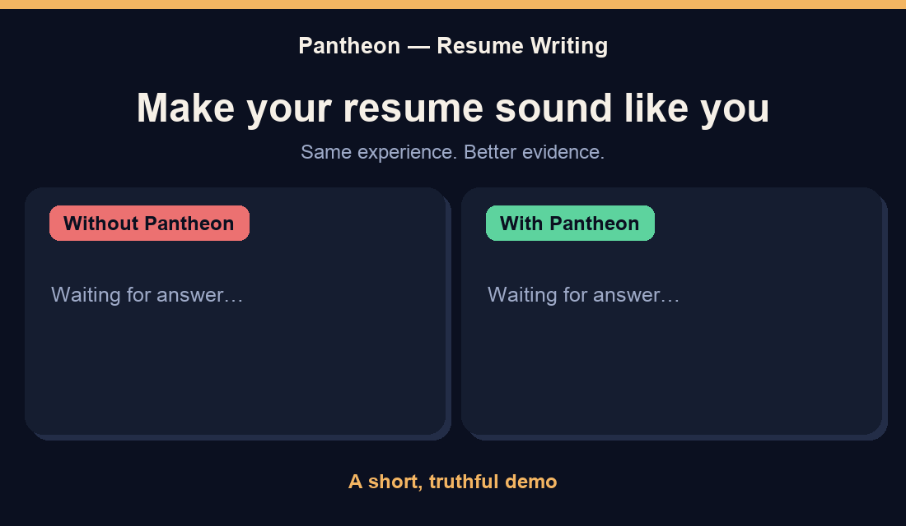

# Pantheon

<p align="center">
  <strong>Your work. Your proof. Your resume.</strong><br>
  A truthful, resume-first skill for turning AI-assisted career writing into something specific, clear, and recognizably yours.
</p>

<p align="center">
  <a href="#how-pantheon-works">How it works</a> ·
  <a href="#use-it-naturally">Use it naturally</a> ·
  <a href="#install">Install</a> ·
  <a href="#boundaries">Boundaries</a> ·
  <a href="#research">Research</a>
</p>

<p align="center">
  
</p>

> **A five-second resume demo:** Pantheon does not invent achievements. It asks for—or works from—real details, then turns them into a stronger, more readable career story.

## How Pantheon works

Pantheon is not a prompt script to memorize. Once installed, it becomes a career-writing ability your AI assistant can use whenever you paste a resume, CV, work history, job description, cover letter, LinkedIn draft, or recruiter email.

It starts with the evidence you already have, then improves the writing around it.

| You provide | Pantheon does |
| --- | --- |
| A resume or a few work-history notes | Clarifies actions, scope, and proof without making up results. |
| A job description | Matches confirmed experience to the role's real requirements. |
| An old bullet that sounds generic | Rewrites it in direct, professional language that still means the same thing. |
| A missing result or metric | Asks one useful question—or leaves the claim modest and truthful. |

## Use it naturally

Paste your resume and ask for help in your own words. That is enough.

> “Here is my resume. Make it clearer for product-support roles.”

> “This bullet sounds like AI. Keep it truthful but make it stronger.”

> “I am applying for this role. Which parts of my experience are genuinely relevant?”

No audience form. No voice worksheet. No magic wording. If a job post is available, include it; if it is not, Pantheon can still improve the resume you have.

### A truthful before-and-after

**Notes supplied by the applicant**

- Worked on a six-person support team.
- Created a shared hand-off template.
- Used feedback from the evening shift.
- Did not measure the outcome.

**Generic AI version**

> Results-driven support professional who leveraged collaboration to deliver transformative customer outcomes.

**Pantheon version**

> Created a shared hand-off template for a six-person support team, incorporating feedback from the evening shift.

The second version is stronger because it is specific—and it does not pretend there is a metric or outcome the applicant never provided.

## What Pantheon improves

- Resume and CV bullets
- Professional summaries
- Role-specific resume tailoring
- Cover letters
- LinkedIn profiles
- Recruiter and networking emails

Pantheon checks generic language such as `results-driven`, `leverage`, `pivotal`, or `transformative`, but it does not use a blacklist. It keeps a word when it is accurate and useful; it changes it only when a clearer fact, action, or detail is available.

## Install

Install once, restart your AI tool, then use it whenever you work on a career document.

### One command for Codex, Claude Code, Hermes Agent, and OpenClaw

```bash
npx skills add bunnyputih/pantheon --skill humanize-ai-writing --global --agent codex --agent claude-code --agent hermes-agent --agent openclaw --copy
```

When prompted, choose **Copy** and confirm. Close and reopen your AI tool when it finishes.

<details>
<summary><strong>Install in one tool only</strong></summary>

Use the same command with just one agent flag:

| Tool | Flag |
| --- | --- |
| Codex | `--agent codex` |
| Claude Code | `--agent claude-code` |
| Hermes Agent | `--agent hermes-agent` |
| OpenClaw | `--agent openclaw` |

For Codex only:

```bash
npx skills add bunnyputih/pantheon --skill humanize-ai-writing --global --agent codex --copy
```

</details>

<details>
<summary><strong>No terminal? Install from a ZIP</strong></summary>

1. Click **Code** on this repository, then choose **Download ZIP**.
2. Open the download and copy the `pantheon` folder.
3. Paste it into the skills folder for your tool, then rename the copied folder to `humanize-ai-writing`.
4. Restart the tool.

| Tool | Mac/Linux | Windows |
| --- | --- | --- |
| Codex | `~/.codex/skills/` | `C:/Users/YourName/.codex/skills/` |
| Claude Code | `~/.claude/skills/` | `C:/Users/YourName/.claude/skills/` |
| Hermes Agent | `~/.hermes/skills/` | `C:/Users/YourName/AppData/Local/hermes/skills/` |
| OpenClaw | `~/.openclaw/skills/` | `C:/Users/YourName/.openclaw/skills/` |

The finished folder must contain `humanize-ai-writing/SKILL.md`.

</details>

Pantheon uses the open-source [Skills CLI](https://github.com/vercel-labs/skills) for the universal installer.

### OpenClaw

Install for all local OpenClaw agents:

```bash
openclaw skills install git:bunnyputih/pantheon@main --global
```

Confirm it is ready:

```bash
openclaw skills list
```

Look for `humanize-ai-writing`. Start a new conversation, paste your resume, and ask naturally—for example, “Make these bullets clear and truthful for a customer-success role.”

To install only in the current workspace, remove `--global`. See the official [OpenClaw Skills guide](https://github.com/openclaw/openclaw/blob/main/docs/tools/skills.md) for advanced workspace settings.

### Hermes Agent

Install Pantheon with Hermes:

```bash
hermes skills install https://raw.githubusercontent.com/bunnyputih/pantheon/main/SKILL.md
```

Confirm it is ready:

```bash
hermes skills list
```

Look for `humanize-ai-writing`. Start a new session, paste your resume or job post, and ask for the help you need. Add `--now` to the install command if the current session should see the skill immediately.

See the official [Hermes Skills guide](https://hermes-agent.nousresearch.com/docs/user-guide/features/skills/) for more options.

### Updates

For a Skills CLI installation:

```bash
npx skills update humanize-ai-writing --global
```

For an OpenClaw Git install, run the original install command again when you want the latest version.

## Boundaries

Pantheon will not:

- fabricate jobs, promotions, degrees, skills, numbers, awards, or outcomes;
- make a resume “undetectable” or promise an AI-detector result;
- keyword-stuff a job description or claim tools the applicant has not used;
- override workplace, hiring, immigration, legal, or disclosure requirements.

The point is not to look like somebody else. It is to make the work you actually did easy to see.

## Research

Pantheon applies research-led principles from factuality, authorship, AI-assisted writing, human evaluation, and text style. In career writing, that means protecting the applicant's facts first, then improving relevance, structure, and voice.

Read the applied [research guidance](references/research-evidence.md) or the full [2020–2026 research corpus](references/research-corpus-2020-2026.md).

## Help Pantheon grow

Open an issue if a resume format, career stage, industry, or language needs better support. Include a short **de-identified** example when possible.

If Pantheon helps someone describe their real work with more confidence and clarity, a star helps the next job seeker find it. ★

## Safety and privacy

Resumes contain personal information. Remove contact details, employer-sensitive material, client information, and anything you are not allowed to share before pasting it into an AI service.
